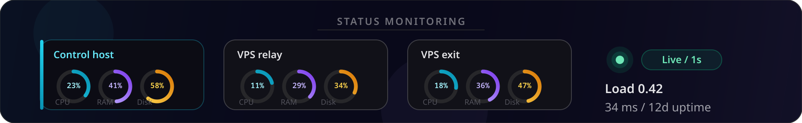

<div align="center">


</div>

> **Self-hosted VPN dashboard.** Your VPS, your rules — no cloud provider or middlemen.

Hoplyra is not just a panel for a single VPN. It is a **multi-hop chain builder**: you compose a route from different protocols and servers, and the system links the hops, configures routing, and delivers **one client config** — at the chain entry.

Product site and install guide: **[hoplyra.com](https://hoplyra.com)**

<div align="center">


</div>

## Panel login

The dashboard is protected by a **local administrator account** (not a cloud signup).

- After `make install`, sign in at **http://YOUR_SERVER_IP:8787** with **`admin` / `admin`**
- Change the password in **Settings** on first use
- Sessions use HTTP-only cookies; SSH passwords for VPS are stored encrypted in the local SQLite database

## Chains

A typical VPN is one tunnel to one server. Hoplyra lets you **combine multiple protocols into a single route** across your VPS nodes:

- **Mix protocols** — AWG, WireGuard, OpenVPN, Xray, and Tor in one chain, each hop on its own server
- **One config for the client** — connect only to the entry; middle hops and exit are configured for you
- **Tor in the chain** — as a relay hop or as an exit with a changing IP
- **Smart deploy** — background deployment with hop-by-hop progress, gateway, iptables, containers, and inter-server links without manual SSH

Common patterns: **AWG → Tor → Xray**, **WireGuard → Xray → Tor**, **OpenVPN → Tor → AmneziaWG** — and hundreds of other combinations from five protocols.

## Status

The **Status** tab shows live health of your control host and every added VPS:

- CPU, memory, disk, load average, uptime, and network throughput
- Per-server latency and container list where available
- Live polling (~1s) when the API can reach servers over SSH

Use it to spot overloaded nodes, offline hosts, and whether metrics collection is working before you deploy chains.

<div align="center">



</div>

## SOCKS5 proxy

The **Proxy** tab exposes an optional **SOCKS5** server for every active VPN or chain.

| | |
|---|---|
| **Purpose** | Browser or app proxy through the same path as your VPN/chain (entry → … → exit) |
| **When** | Config status is **active**; enable/disable without redeploy |
| **Where in UI** | **Proxy** — filter by all routes, chains, or single VPN; collapse/expand cards |

<div align="center">


</div>

## Desktop (Linux)

Portable AppImage for local use — no server install required.

**Download:** [Hoplyra 1.3.1 AppImage](https://github.com/Linchevatel/Hoplyra/releases/download/v1.3.1/Hoplyra-1.3.1-x86_64.AppImage)

```bash
sudo apt install libfuse2   # Ubuntu/Debian, if AppImage won't start
chmod +x Hoplyra-1.3.1-x86_64.AppImage
./Hoplyra-1.3.1-x86_64.AppImage
```

Requires **64-bit Linux, glibc 2.35+** (Ubuntu 22.04+, Debian 12+).

Build from source: see [desktop/README.md](desktop/README.md).

## Quick start

Dependencies (Debian / Ubuntu example):

```bash
sudo apt install make python3-venv podman podman-compose
```

```bash
git clone https://github.com/Linchevatel/Hoplyra.git
cd Hoplyra
make install
```

Open **http://YOUR_SERVER_IP:8787** (locally: **http://127.0.0.1:8787**) and sign in with **`admin` / `admin`**.

## Container images

| Image | Purpose |
|-------|---------|
| `hoplyra-gateway:1` | Xray + Tor + iptables (AWG/WG/OpenVPN chains) |
| `hoplyra-tor:1` | Tor sidecar |
| `hoplyra-xray:1` | Xray relay/exit |
| `hoplyra-wg:1` | WireGuard in a container |
| `hoplyra-openvpn:4` | OpenVPN + PKI |
| `hoplyra-socks:1` | 3proxy sidecar for standalone SOCKS5 |

## Protocols

| | ID | Protocol | Port |
|:-:|---|----------|------|
|  | `wg` | WireGuard | 51820/udp |
|  | `awg` | AmneziaWG 2.0 | 55424/udp |
|  | `openvpn` | OpenVPN | 1194/udp or tcp |
|  | `xray` | Xray VLESS + TLS / REALITY | 443/tcp |
|  | `tor` | Tor (SOCKS) | 9050/tcp |

## Support the project

| | Network | Address |
|:-:|---------|---------|
|  | Bitcoin | `bc1q0u4pwuqxg7kt5y4p84lc8zzcawhzr3auzw005z` |
|  | Ethereum | `0xD3002c0967a8D28FDF67c2Df8488006e965B9a6A` |
|  | TRON (TRC-20) | `TYUkmupkzCGzkio77Db7PKEDu4JN8JD1eb` |
|  | TRON | `TX7yRGo5xT2Mj5NBVhu7bdv58jmStHFuGZ` |

Donation section and feature overview are also on **[hoplyra.com](https://hoplyra.com)**.

## License

MIT · [hoplyra.com](https://hoplyra.com)
